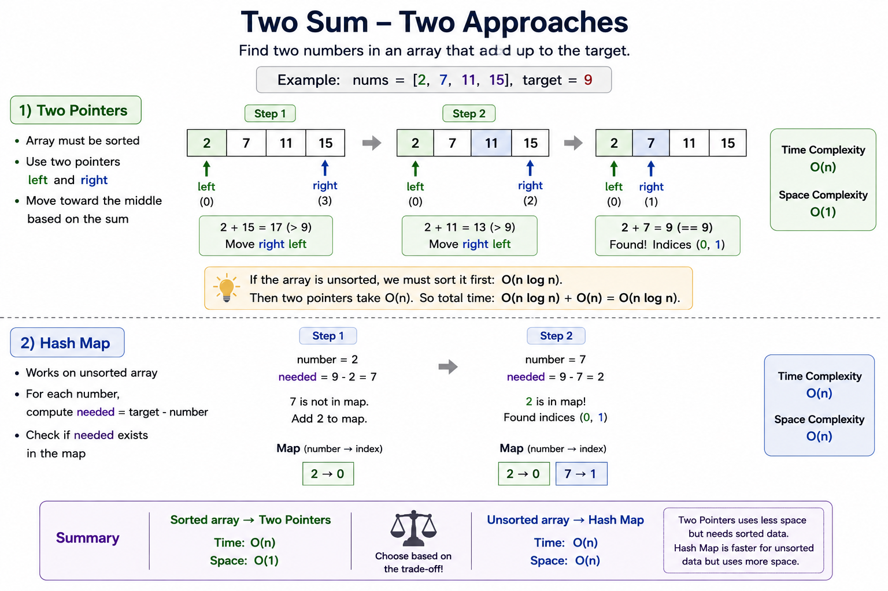

# Two Sum



In this section, we go through the popular **Two Sum** exercise using two different approaches:

## 1. Two Pointers

We use two pointers, `left` and `right`, starting from opposite ends of the array and moving toward the middle until we find two numbers whose sum matches the target.

This approach requires the array to be **sorted**.

* Time Complexity: `O(n)`
* Space Complexity: `O(1)`

If the array is unsorted, we first need to sort it.

Sorting takes `O(n log n)`, and then the Two Pointers scan takes `O(n)`.

So the total is:

```text
O(n log n) + O(n)
```

Since `O(n log n)` grows faster than `O(n)`, the final time complexity is:

```text
O(n log n)
```

## 2. Hash Map

For an unsorted array, a hash map is usually the better approach in terms of time complexity.

For each number, we calculate the value we need:

```python
needed = target - number
```

Then we check if that value has already been seen.

* Time Complexity: `O(n)`
* Space Complexity: `O(n)`

The hash map approach is faster for an unsorted array because it does not require sorting, but the trade-off is that it uses additional memory.

## Summary

* Sorted array → **Two Pointers:** `O(n)` time, `O(1)` space
* Unsorted array → **Hash Map:** `O(n)` time, `O(n)` space
* Unsorted array + sorting + Two Pointers → `O(n log n)` time
