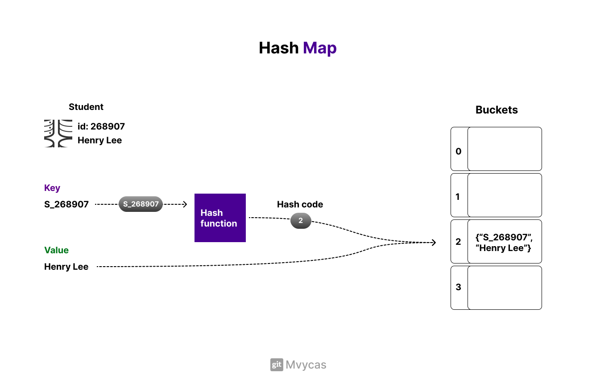
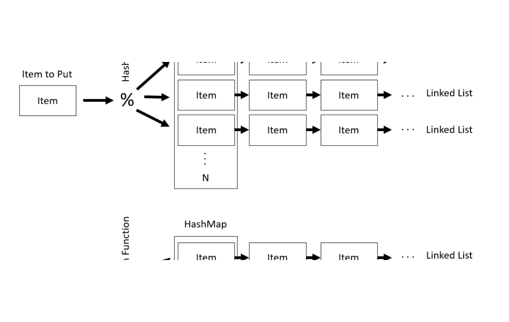

# Hash maps

It is rather a simple illustration how hash map works.
To begin with, it takes the key, which in this example is "S_268907" 
and then the hash function generates a hash code.
Typically, the HashCode is a large int that uniquely represents 
the key (as uniquely as possible). 

Let's say that the hash function produced a hash code of "493827158", which represents our key "S_268907".
After this the hash function needs to determine in which bucket 
(index) in the internal array the key value pair should be stored.
Usually it is done using the modulo operation "index = hashCode % arrayLength". 
In our case "index = 493827158 % 4 = 2". This is where our key value pair is getting placed.

Search, retrieval, and deletion in a hash map are typically O(1) on average. 
This efficiency comes from the fact that, given a key, the hash function 
calculates the index at which the key-value pair is stored in the internal array, allowing for direct access.

"Internally, the hashmap uses an array, and it maps the labels to array
 indexes using a hash function." - as Someone on the Internet said.

For example, in a simple array data structure, if you needed to find
 "Henry Lee," you would have to go through all the indexes linearly, 
 which would result to O(n), with n being the size of that array. Of course, 
 if, somehow, you knew at what index Mr. Lee was stored, you could directly access it.

A key in a hash map provides you with this exact index (direct access) since 
it is used by the hash function to determine at which bucket the data was stored.
The key is more meaningful and intuitive.

# Hash Sets

"Collection that stores only unique elements"

It is a very similar Data structure to the Hash map, just that in the Hash Set each element functions as both the key and the value. Hash Sets primarly being used to check uniqueness of the elements within a collection. (For example, Data integrity checks or removing duplicates).

**For example, in the Hash Map only the key must be unique!**

# Collisions 

Collisions happen in hash map when two keys hashing to the same index.
This is because the world is not perfect, nor the Hash Functions. 
The internal array or buckets (array slots) in a hash map has a fixed size and is limited, 
and there is virtually infinite number of possible keys. 
Since there is more possible keys than buckets, 
some keys is expected to be mapped to the same bucket, again, this is when the collision happens.

## Analogy: Story teller

Think of yourself as a story teller, and you got 100 different stories to tell. 
Each story is unique in it's own way. Now think of the hash function as your listener. 
After you end up telling all the stories, you ask your listener to summarize all of them in just mere THREE WORDS! 
It is very likely that your listener will summarize two similar, but unique stories with the same three word summary...
This is exactly what happens with the hash map.

# Methods to resolve Collisions

When a collision appears once at specific index it is very likely that it will appear again at the same index.
In a bad hash map implementation this may lead to Clustering, further degrading hash map performance.
Clustering is a pehnomenon where multiple keys end up being placed in the same or adjacent buckets.

## **Linear probing**

If a key hashes to an index that is already occupied, the key-value pair is placed in the next available position (bucket).
Drawback: Leads to clustering.

## **Separate chaining**

In separate chaining the hash map is actually an array of pointers to linked lists (linked list at each index/bucket of the internal array).
When collision occurs the key-value pair is inserted at the HEAD (first element) of the appropriate linked list.

It is important that the hash function is well implemented. 
Ideally it should distribute keys evenly across the buckets in the internal array.  
If too many keys are placed in the same bucket, it would lead to an imbalanced distribution and would cause the linked list in those buckets to grow longer. 
This would downgrade the performance, since traversing a linked list is O(n).

# Good hash function specifications

- Makes use of all information provided by the key;
- Distributes hash values evenly across the hash map / table;
- Map similar keys to very different hash values;
- Uses fast operations.

# Q&A:

## A map/dictionary is created and the following key-value pairs are added in the following order: {"a" : 2}, {"b": 3}, {"a", 4}, {"c", 5}. What is the value associated with the key "a"?

Answer: 4. If you add a value to a map/dictionary with a key that already exist, that new value will replace the original value.

##  True or False: A map/dictionary stores values in a specific order.

Answer: False. Generally the values in a map/dictionary are unordered and stored based on their hash values. However, it can be implemented to maintain a particular order (for example, Java's LinkedHashMap, or C# SortedDictionary).

##  What's the Big-O run time for inserting a value into a hash table/dictionary?

Answer: O(1)
